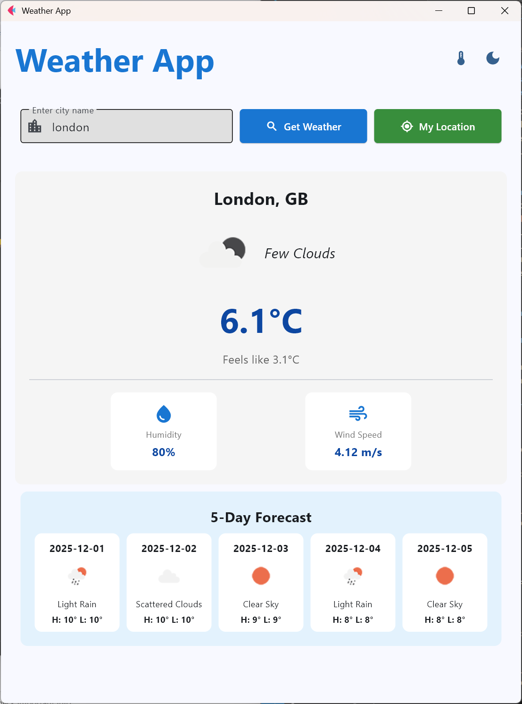
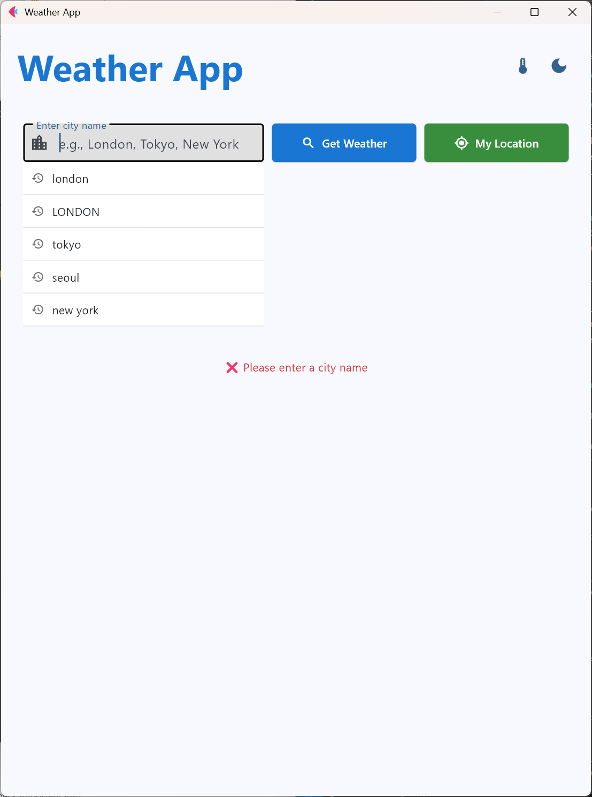
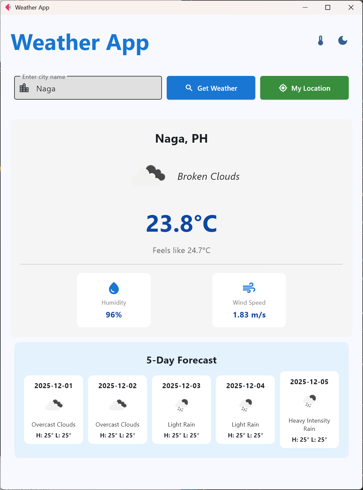
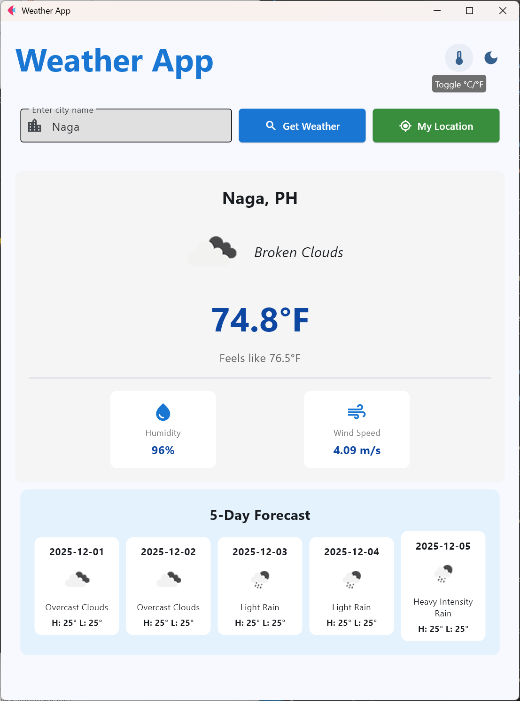
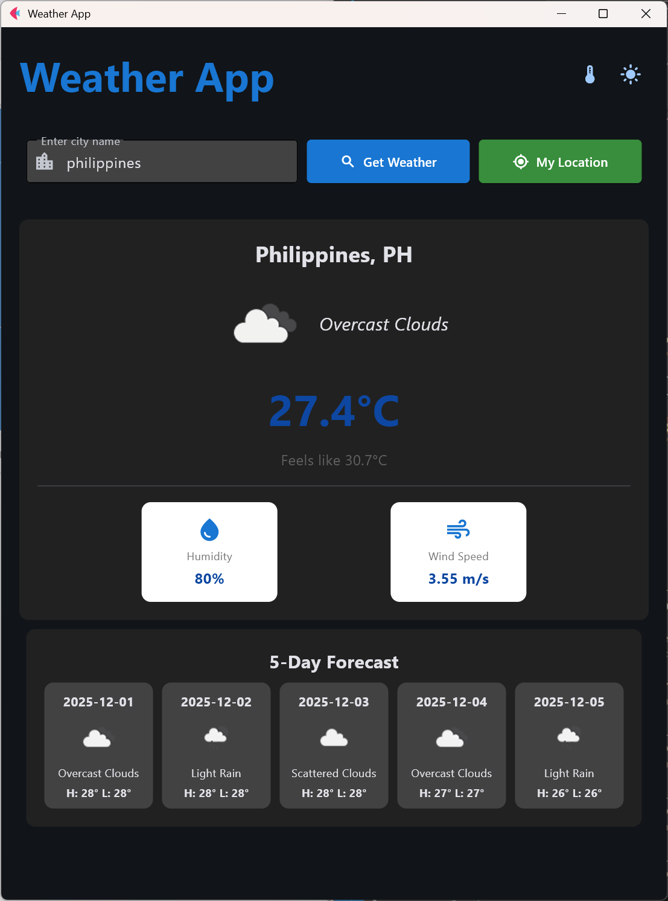

# Weather Application - Module 6 Lab

## Student Information
- **Name**: Tischia Ann R. Olivares
- **Student ID**: 231002283
- **Course**: CCCS 106
- **Section**: A

## Project Overview
The Weather Application is a cross-platform desktop and web app built with **Flet v0.28.3**. It fetches real-time weather data from the OpenWeatherMap API and displays it in a clean, modern interface. Users can search for cities, view current temperature, humidity, wind speed, and see weather icons reflecting current conditions. The app handles errors gracefully and is designed with a responsive Material Design UI.

## Features Implemented

### Base Features
- [✓] City search functionality
- [✓] Current weather display
- [✓] Temperature, humidity, wind speed
- [✓] Weather icons
- [✓] Error handling
- [✓] Modern UI with Material Design
- [✓] Responsive layout for desktop, web, and mobile

### Enhanced Features
1. **Dark Mode Support**
   - Users can toggle between light and dark themes using a theme button.
   - Improves accessibility and user experience.

2. **Animated Weather Display**
   - Weather information fades in with smooth animation for a modern look.
   - Adds a visually appealing effect.
   - Challenge: Coordinating async tasks with animation; solved using `await asyncio.sleep()` and `self.page.update()`.

3. **Search History**
   - Keeps track of the last 5 cities searched.
   - Users can quickly select previously searched cities.
   - Challenge: Managing a dynamic dropdown and search history click not triggering fetch weather; solved using a Flet Column to display clickable history items and a dedicated handle_history_click function that updates the input and calls get_weather asynchronously.

4. **Temperature Unit Toggle**
   - Allows users to switch between Celsius (°C) and Fahrenheit (°F).
   - Converts and redisplays the current weather data in the selected unit.
   - Challenge: Refreshing the weather display with updated units; solved using the toggle_units method to update current_unit and rerun refresh_weather_display.

5. **5-Day Weather Forecast**
   - Displays a 5-day forecast for the searched city with temperature and conditions.
   - Provides users with short-term weather planning information.
   - Challenge: Parsing and displaying forecast data from the API; solved using Flet's UI components in a responsive layout.


## Screenshots
- Main Weather Display with 5-Day Forecast


- Search History


- Current Location Weather


- Temperature Unit Toggle


- Dark Mode Enabled



## Installation

### Prerequisites
- Python 3.8 or higher
- pip package manager
- OpenWeatherMap API key

### Setup Instructions
```bash
# Clone the repository
git clone https://github.com/chiaseedss/cccs106-projects.git
cd cccs106-projects/mod6_labs

# Create virtual environment
python -m venv venv
source venv/bin/activate  # On Windows: venv\Scripts\activate

# Install dependencies
pip install -r requirements.txt

# Create .env file
cp .env.example .env
# Add your OpenWeatherMap API key to .env
