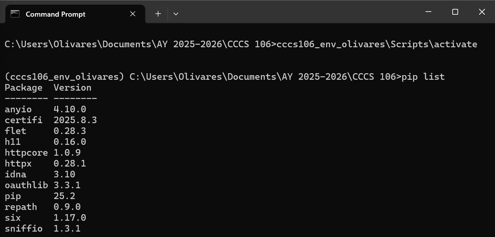
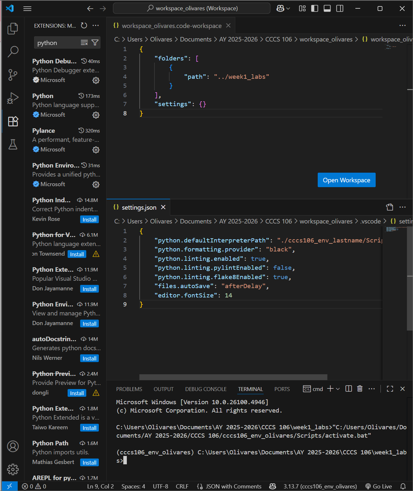
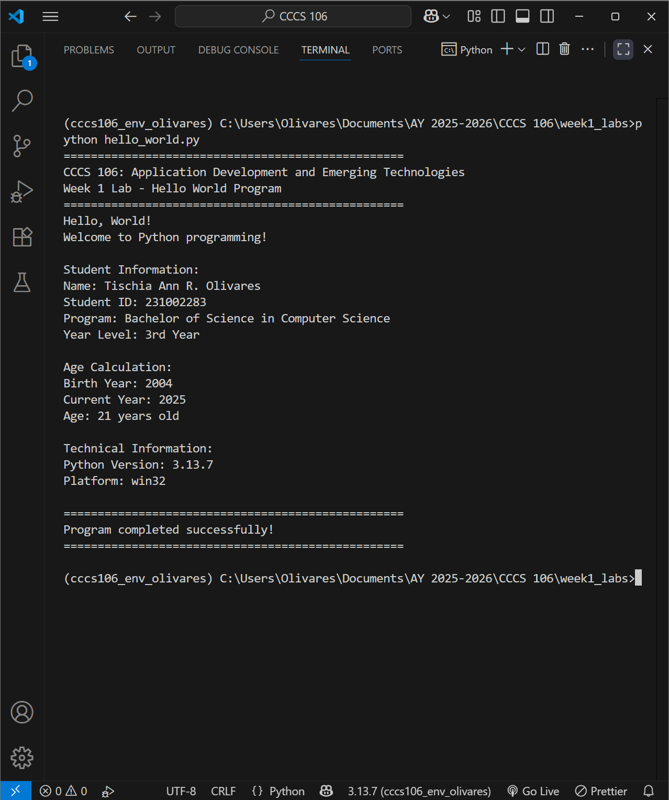
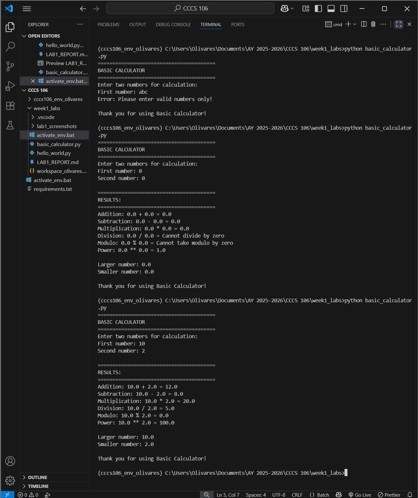

# Lab 1 Report: Environment Setup and Python Basics

**Student Name:** Tischia Ann R. Olivares

**Student ID:** 231002283

**Section:** A

**Date:** August 27, 2025

## Environment Setup

### Python Installation
- **Python Version:** 3.13.7
- **Installation Issues:** 
Issue: "python is not recognized" since I forgot to add it to the path
Solution: Modified the setup and added python to environment variables
- **Virtual Environment Created:** ✅ cccs106_env_olivares

### VS Code Configuration
- **VS Code Version:** 
1.103.2 (x64)
- **Python Extension:** ✅ Installed and configured
- **Interpreter:** ✅ Set to cccs106_env_olivares/Scripts/python.exe

### Package Installation
- **Flet Version:** 0.28.3
- **Other Packages:** 
    - anyio    4.10.0
    - certifi  2025.8.3
    - flet     0.28.3
    - h11      0.16.0
    - httpcore 1.0.9
    - httpx    0.28.1
    - idna     3.10
    - oauthlib 3.3.1
    - pip      25.2
    - repath   0.9.0
    - six      1.17.0
    - sniffio  1.3.1

## Programs Created

### 1. hello_world.py
- **Status:** ✅ Completed
- **Features:** Student info display, age calculation, system info
- **Notes:** None

### 2. basic_calculator.py
- **Status:** ✅ Completed
- **Features:** Basic arithmetic, **added modulo and power calculations**, error handling, min/max calculation
- **Notes:** None

## Challenges and Solutions
Didn't really encounter major challenges since I am already familiar with setting up environments. Some minor troubleshooting issues were easily solved through following the instructions from leons and quick google search. 

## Learning Outcomes
I was able to refresh my knowledge of setting up virtual environments in python. Development environments allow us to isolate packages for each project so it doesn't interfere with other projects, make our workplace cleaner/more organized, and it is safer to experiment here without affecting the global setup.

## Screenshots

**Environment Setup:**

**Visual Studio Code Setup:**

**Hello World Output:**

**Basic Calculator Output:**

