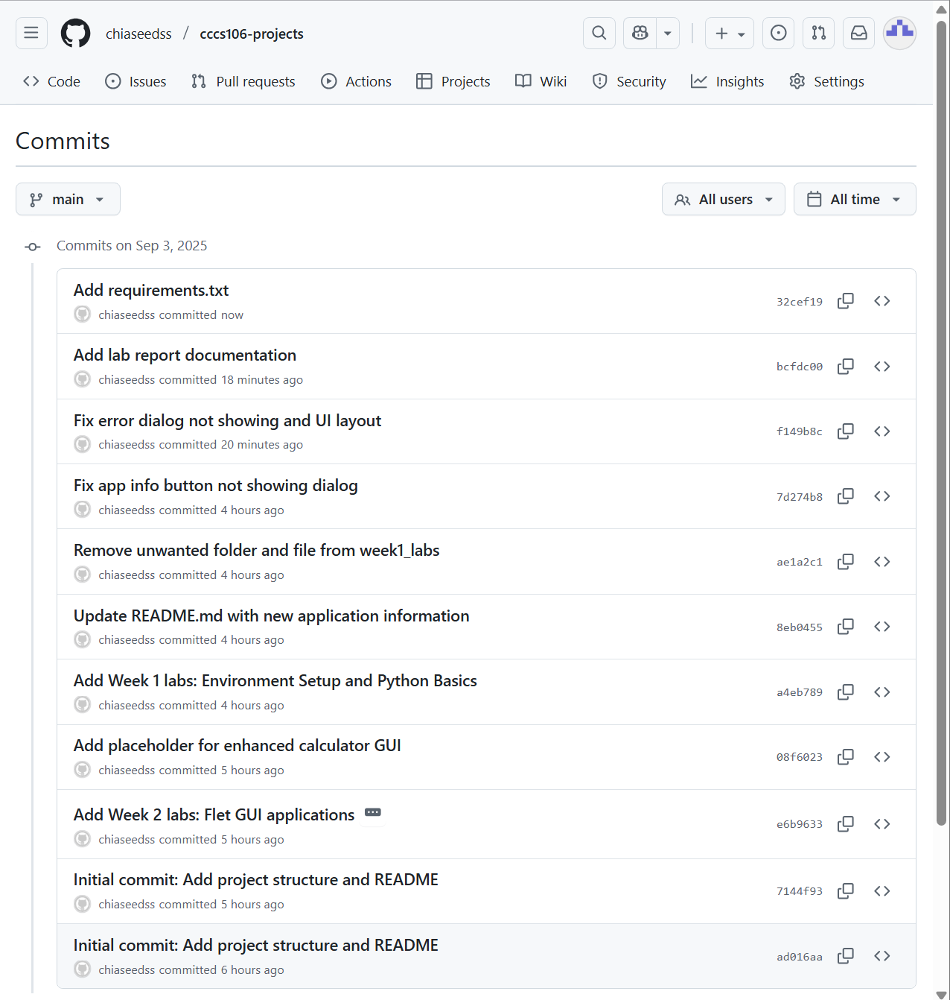
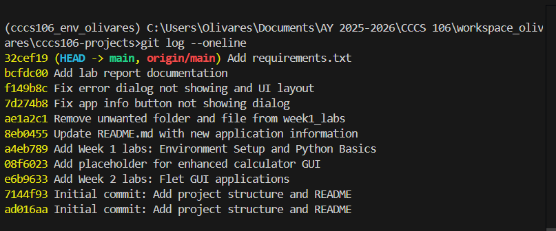
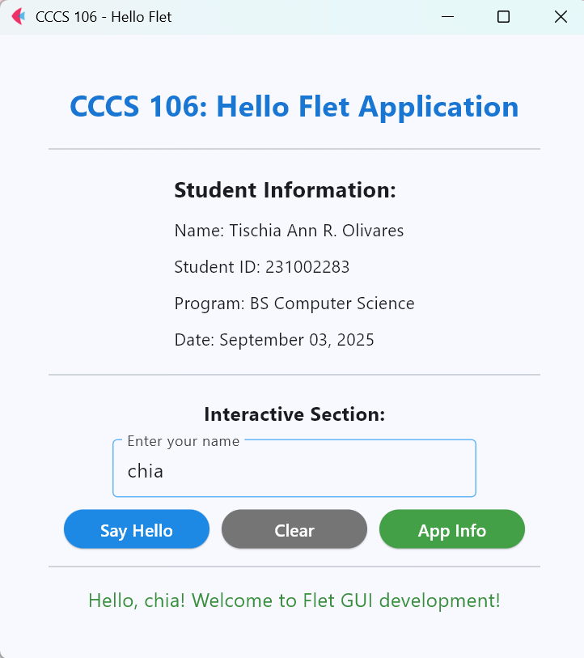
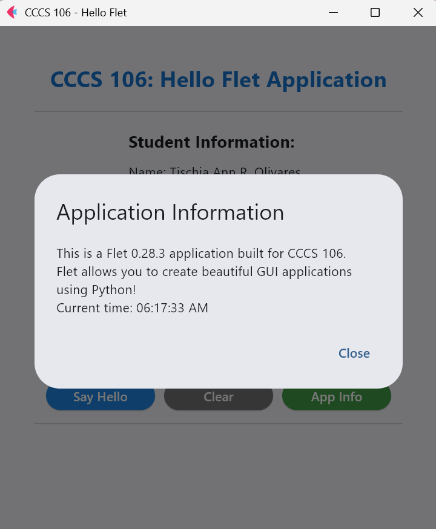
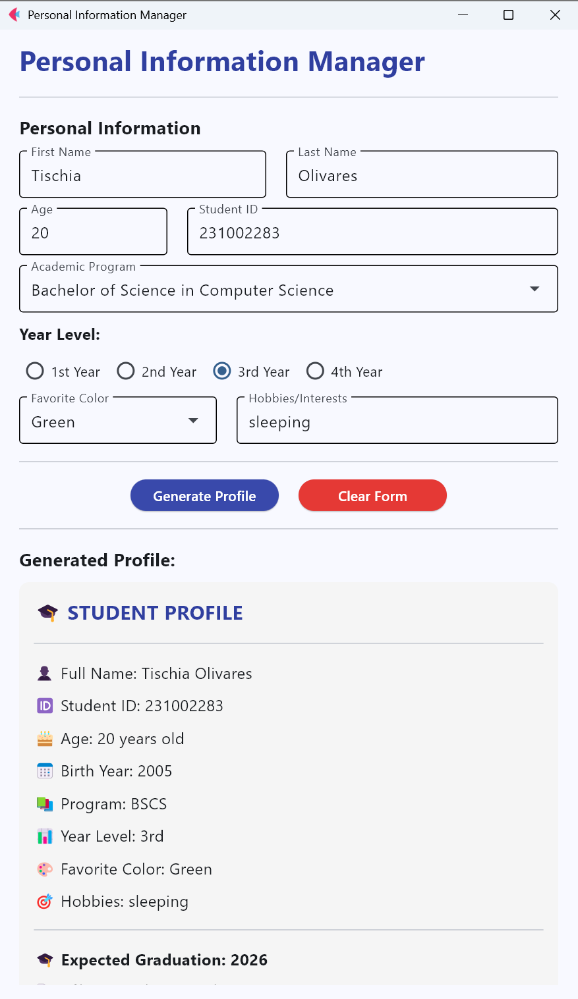
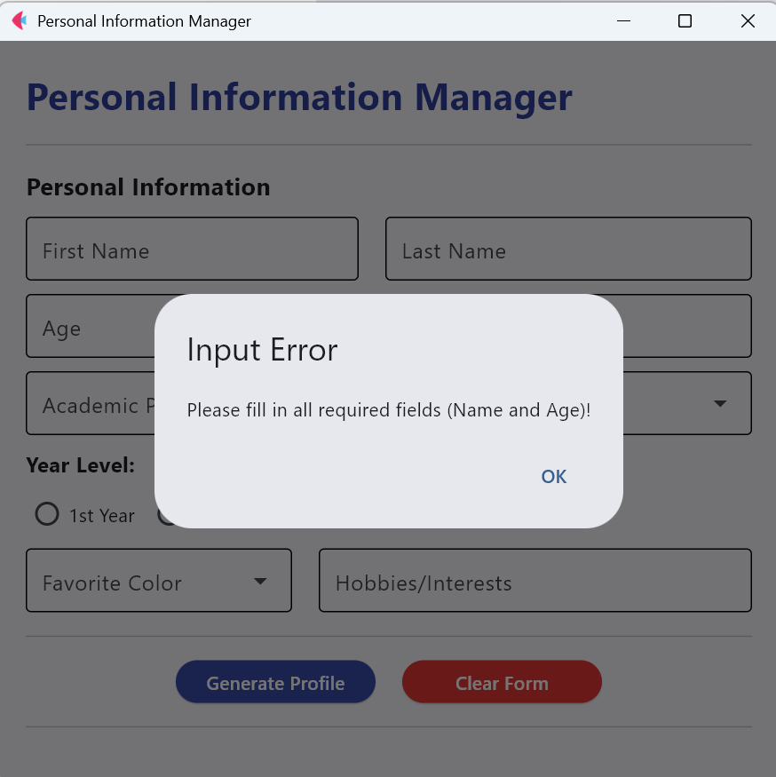
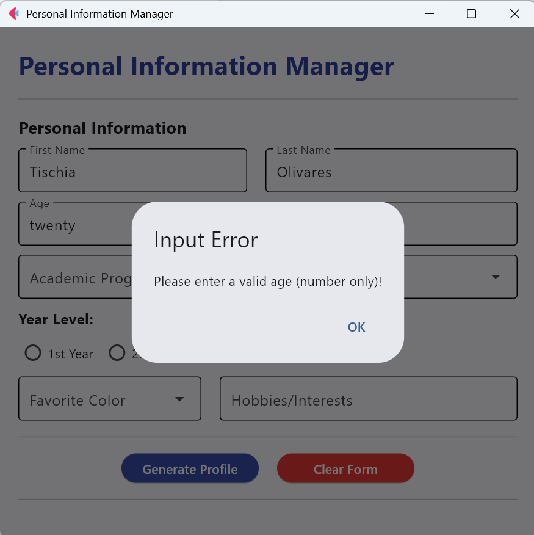

# Lab 2 Report: Git Version Control and Flet GUI Development

**Student Name:** Tischia Ann R. Olivares

**Student ID:** 231002283

**Section:** A

**Date:** September 3, 2025

## Git Configuration

### Repository Setup
- **GitHub Repository:** https://github.com/chiaseedss/cccs106-projects.git
- **Local Repository:** ✅ Initialized and connected
- **Commit History:** 6 commits with descriptive messages

### Git Skills Demonstrated
- ✅ Repository initialization and configuration
- ✅ Adding, committing, and pushing changes
- ✅ Branch creation and merging
- ✅ Remote repository management

## Flet GUI Applications

### 1. hello_flet.py
- **Status:** ✅ Completed
- **Features:** Interactive greeting, student info display, dialog boxes
- **UI Components:** Text, TextField, Buttons, Dialog, Containers
- **Notes:** App info button not working. This was solved by attaching the dialog to the page and using page.open(dialog) and updating close button to use page.close(dialog).

### 2. personal_info_gui.py
- **Status:** ✅ Completed
- **Features:** Form inputs, dropdowns, radio buttons, profile generation
- **UI Components:** TextField, Dropdown, RadioGroup, Containers, Scrolling
- **Error Handling:** Input validation and user feedback
- **Notes:** Error messages are not showing. Like the app info from the hello_flet program, the error dialog box is also not showing. I had to fix age validation too for it to accept only integer inputs.

## Technical Skills Developed

### Git Version Control
- Understanding of repository concepts
- Basic Git workflow (add, commit, push)
- Branch management and merging
- Remote repository collaboration

### Flet GUI Development
- Flet 0.28.3 syntax and components
- Page configuration and layout management
- Event handling and user interaction
- Modern UI design principles

## Challenges and Solutions

I have prior knowledge and experience with using git and github so there wasn't much problems that were encountered. Common issues that occured were easily fixed with common troubleshooting and quick google search. Most of the challenges encountered were with the dialog not showing.

## Learning Outcomes

With this activity, I was able to refresh my knowledge with version control and introduced to the development of interactive GUI applications using flet. I also learned about the new dialog usage in flet to fix the dialog box not showing.

## Screenshots

### Git Repository
 - GitHub repository with commit history

- Local git log showing commits

### GUI Applications
- 'hello_flet.py running with all features

- fixed app info

- personal_info_gui.py with filled form and generated profile plus fixed layout

- fixed error diaolog

## Future Enhancements
- Implement responsive layout
- Additional interactive features for the generated profiles