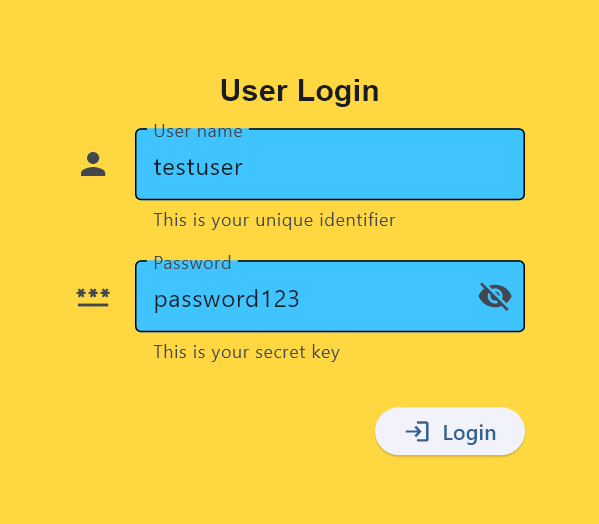
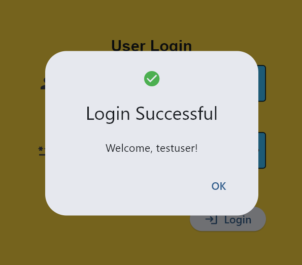
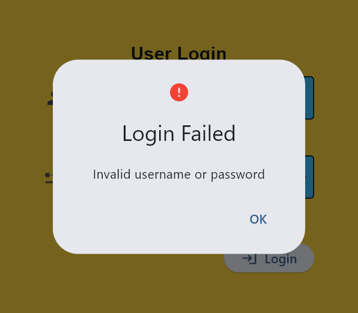
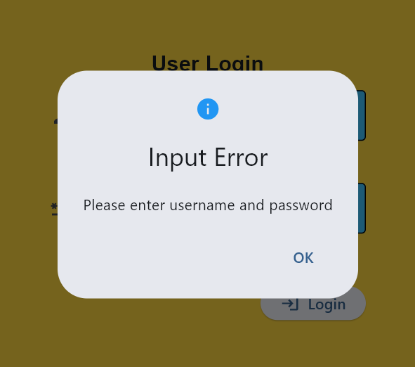
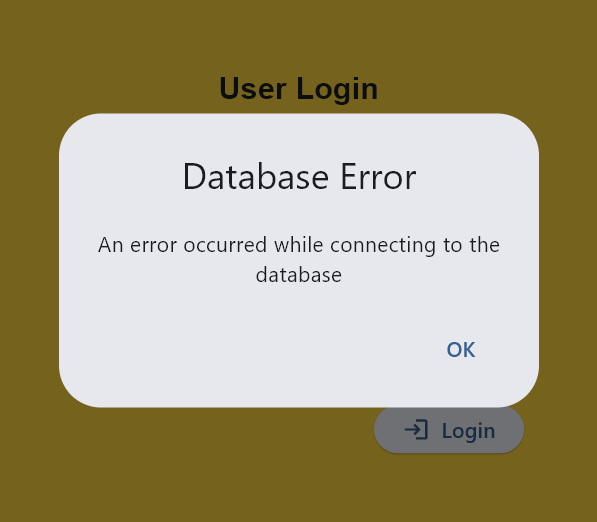

# Lab 3 Report: Flet User Login Application

**Student Name:** Tischia Ann R. Olivares

**Student ID:** 231002283

**Section:** A

**Date:** September 17, 2025

## Flet User Login Application

### 1. db_connection.py
- **Status:** ✅ Completed
- **Function:** Connects the Flet app to the MySQL database.
- **Configuration:**
  - host: localhost  
  - user: root  
  - password:  [insert database password]
  - database: fletapp

### 2. main.py
- **Status:** ✅ Completed
- **Features:** User login form with authentication through MySQL
- **UI Components:** Text, TextField, ElevatedButton, Dialog, Icons, Containers, Columns
- **Dialogs Implemented:**
  - Login Successful — displays a welcome message  
  - Login Failed — invalid username or password  
  - Input Error — missing username or password  
  - Database Error — connection issue with MySQL

## Technical Skills Developed

### Flet GUI Development
- Creating and arranging components using Flet
- Handling button click events
- Using dialogs for validation and feedback
- Applying page layout and alignment options

### Database Integration
- Establishing connection with MySQL using mysql.connector
- Creating and managing database tables
- Authenticating login credentials with SQL queries
- Handling connection errors

## Challenges and Solutions

Most issues encountered were related to database connection and dialog handling.  
- **Database Connection Error:** MySQL service was not running. Solved by restarting MySQL and verifying credentials.  
- **Dialogs Not Showing:** Fixed by properly attaching dialogs to page and calling page.open(dialog).  
- **Frameless Window Alignment:** Adjusted using page.window.alignment = ft.alignment.center property.  

## Learning Outcomes

Through this activity, I learned how to connect Flet applications to a MySQL database and implement user authentication. I also became more familiar with using dialogs for interactive feedback. This lab also improved my confidence in integrating backend and frontend functionalities in a single Python-based GUI application.

## Screenshots

### Git Repository
- Application Login Window

- Successful Login

- Failed Login

- Input Error

- Database Error

