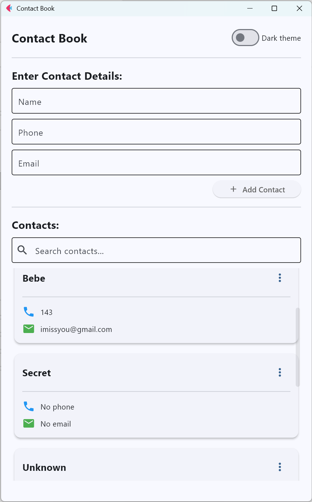
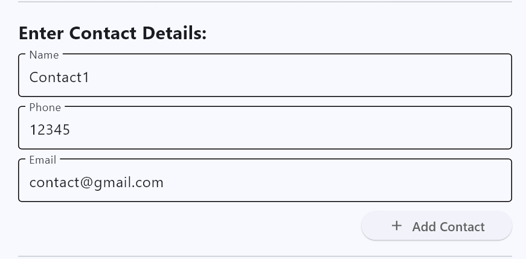
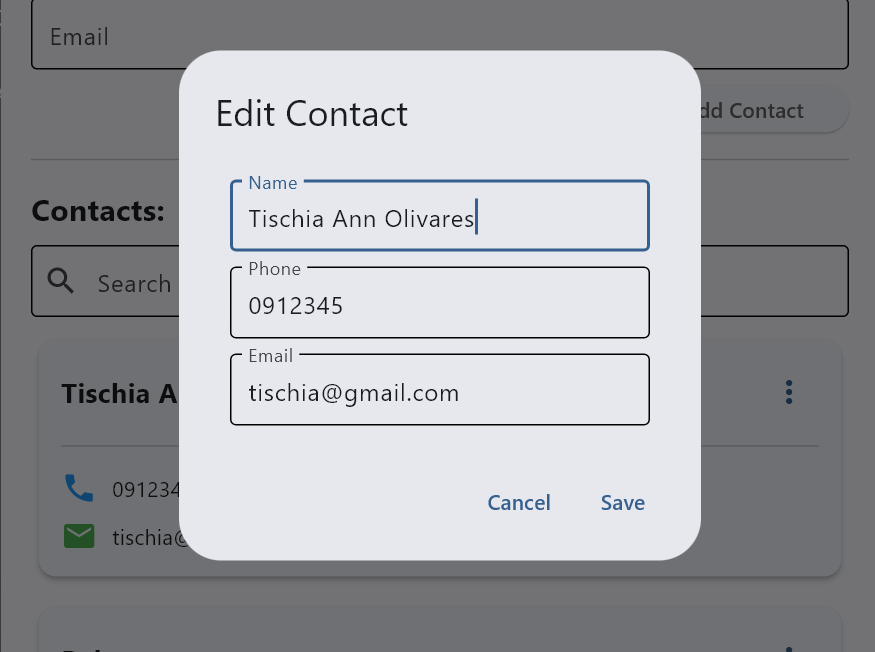
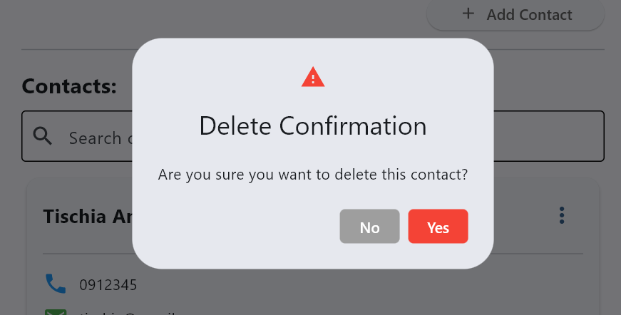
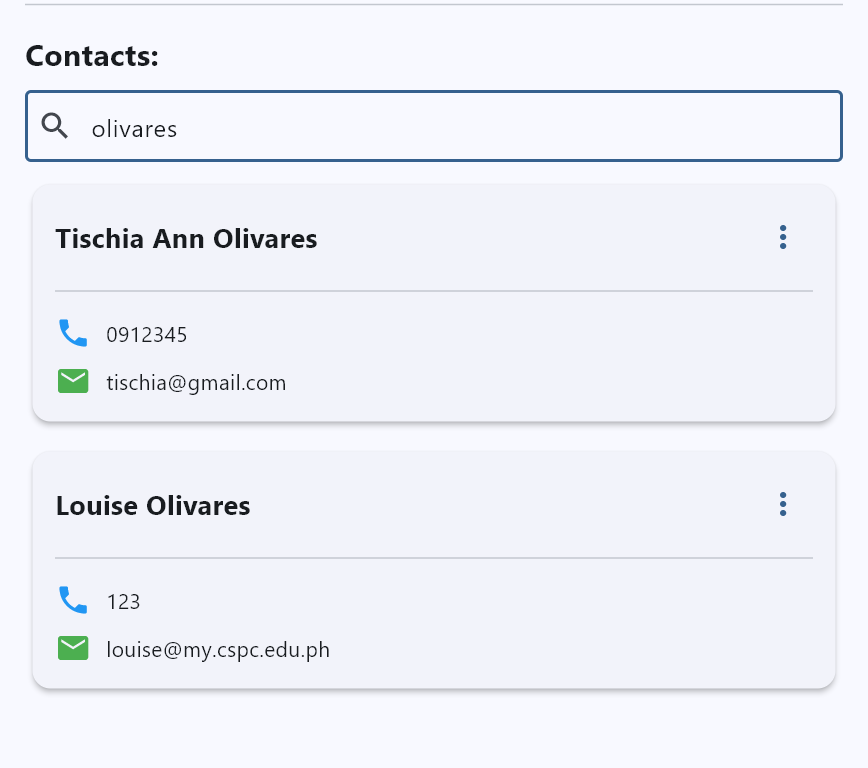

# Lab 4 Report: Contact Book Application Enhancement

**Student Name:** Tischia Ann R. Olivares

**Student ID:** 231002283

**Section:** A

**Date:** September 22, 2025

## Contact Book Application Enhancement

### 1. database.py
- **Status:** ✅ Completed  
- **Function:** Handles all database operations for storing, retrieving, updating, and deleting contact information.  
- **Database Used:** SQLite (contacts.db)  
- **Key Features:**
  - init_db()
  - add_contact_db()
  - get_all_contacts_db(search_term="")
  - update_contact_db()
  - delete_contact_db() 
- **Enhancement:** Supports search functionality for contacts using SQL LIKE queries

### 2. app_logic.py
- **Status:** ✅ Completed  
- **Function:** Manages all business logic, connecting user actions to database operations.  
- **Key Features**
  - Displaying contacts using Flet Cards
  - Adding, updating, and deleting contacts
  - Editing contacts through a dialog
- **Enhancements:**
  - Added input validation 
  - Added delete confirmation dialog
  - Integrated UI updates after each operation  

### 3. main.py
- **Status:** ✅ Completed  
- **Function:** Builds the main Flet UI window and connects user input fields with database logic.  
- **Key Features:**  
  - Form for adding new contacts  
  - Dynamic list of saved contacts  
  - Buttons and dialogs for managing data
  - Integrated search field for contact filtering
- **Enhancements:**
  - Added dark/light mode toggle using ft.Switch
  - Enhanced UI layout with containers and cards. 

## Technical Skills Developed

### Flet GUI Development
- Structuring and organizing components using row, column, container, and card.
- Implementing interactive controls like popup menu, switch, and dialogs. 

### Database Integration
- Using SQLite with Python  
- Executing CRUD (Create, Read, Update, Delete) operations
- Implementing filtered data retrieval with SQL LIKE.

### Software Design & Architecture
- Practiced modular programming by separating UI, logic, and database layers.
- Applied event-driven programming principles.
- Enhanced maintainability by organizing code across multiple Python files.

## Challenges and Solutions
- Contacts didn’t refresh after editing. Solved by calling display_contacts() after saving in the edit dialog to reload data. 
- Application allowed saving contacts with empty names. Solved by adding input validation with name_input.error_text = "Name cannot be empty" before saving. 
- UI felt plain and cluttered. Solved by replacing ListTile with Card components and added scroll feature.

## Learning Outcomes

Through this lab, I  strengthened my skills in building interactive desktop applications using flet and SQLite.  I also understood the importance of organizing projects using multiple files for better readability. I learned how to manage real-time data updates with event-driven UI, and combine backend data logic with front-end visual design. To add, I also implemented user-friendly features like validation, confirmation dialogs, search, and theming.

## Screenshots

- Contact Book Main Window  

### ➕ Add Contact  

### 📝 Edit Contact  

### ❌ Delete Contact Confirmation  

### 🧠 Search Contact

---

## Feature enhancement:
- Input validation for empty names  
- Delete confirmation dialog  
- Search functionality for filtering contacts  
- Dark mode toggle  
- Card-based contact display for better visuals  
- Scrollable contact list
